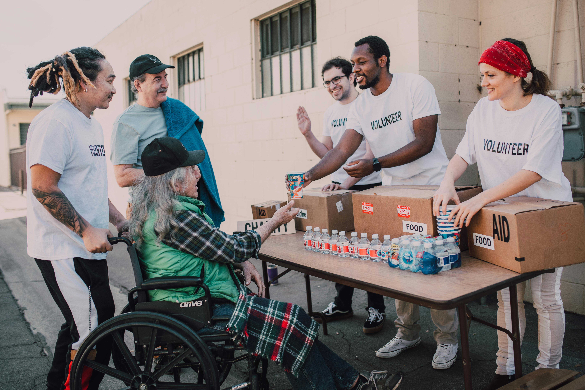

> "Hunger is not a lack of food. It’s a lack of connection."

*Connecting communities through shared meals.*

According to Feeding America, more than **50 million people in the U.S.** turned to food banks, pantries, or free meal programs in 2023, showing that the need for accessible, community-driven food assistance has never been greater.

No one should have to worry about where their next meal will come from. That’s the idea that inspired [**FreeFoodsNearMe**](https://freefoodsnearme.com), a platform built to connect people not only with local food pantries, free meal programs, and community resources, but also with each other, allowing residents to share their extra food with neighbors in need.

--- 

### 🌎 Our Mission

[**FreeFoodsNearMe**](https://freefoodsnearme.com) began with a simple goal: make finding and sharing free food quick, easy, and stigma-free.  
Whether you’re a student, a parent, or someone going through a tough time, food assistance should never be complicated.

What makes this platform unique is that it’s for everyone, not just those seeking help.  
Residents can post their own extra food, even if it's only a bag of potatoes, so someone nearby can pick it up instead of it going to waste. It’s about building a cycle of kindness, where sharing food becomes part of everyday life.

---

### 🥫 Verified Listings

Our listings feature **verified food pantries, community fridges, and meal programs** with up-to-date details like hours, locations, and types of food offered.  
Right now, we’re focused on serving the **Greater Cincinnati area**, but the mission is growing.  
Over time, we aim to make **FreeFoodsNearMe** a nationwide network for food access and community sharing.

---

### 💬 Join the Movement

At **FreeFoodsNearMe**, we believe that community and compassion go hand in hand.  
By sharing this platform, you’re helping someone find their next meal, and that’s something powerful.

---

### 🌐 Connect With Us

- [🌸 Instagram](https://www.instagram.com/freefoodsnearme/)
- [📘 Facebook](https://www.facebook.com/profile.php?id=61581662233758)
- [🌍 Visit our Website](https://freefoodsnearme.com)

---

*Together, we can make sure that no meal — and no person — is left behind.*
